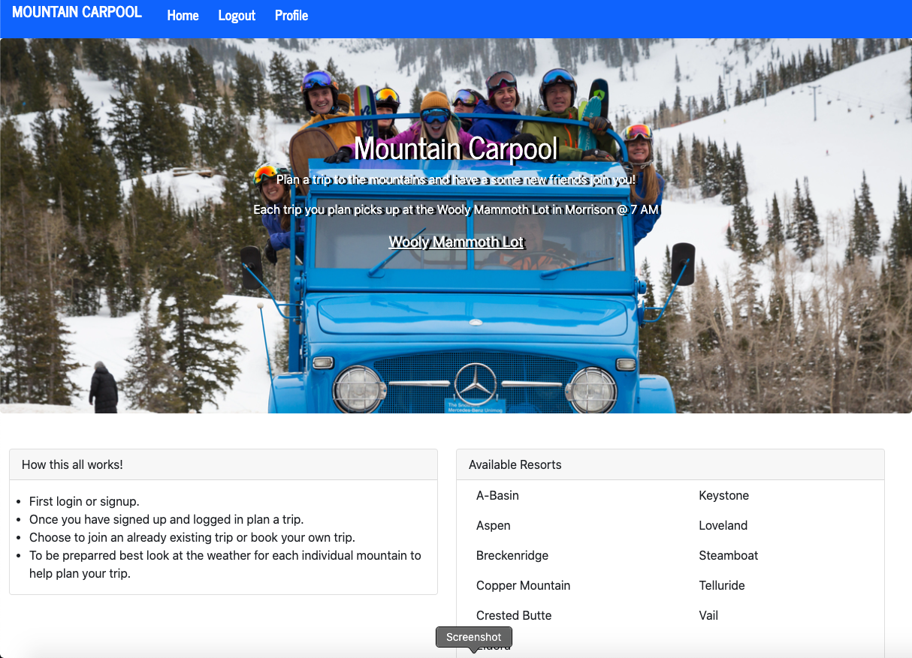
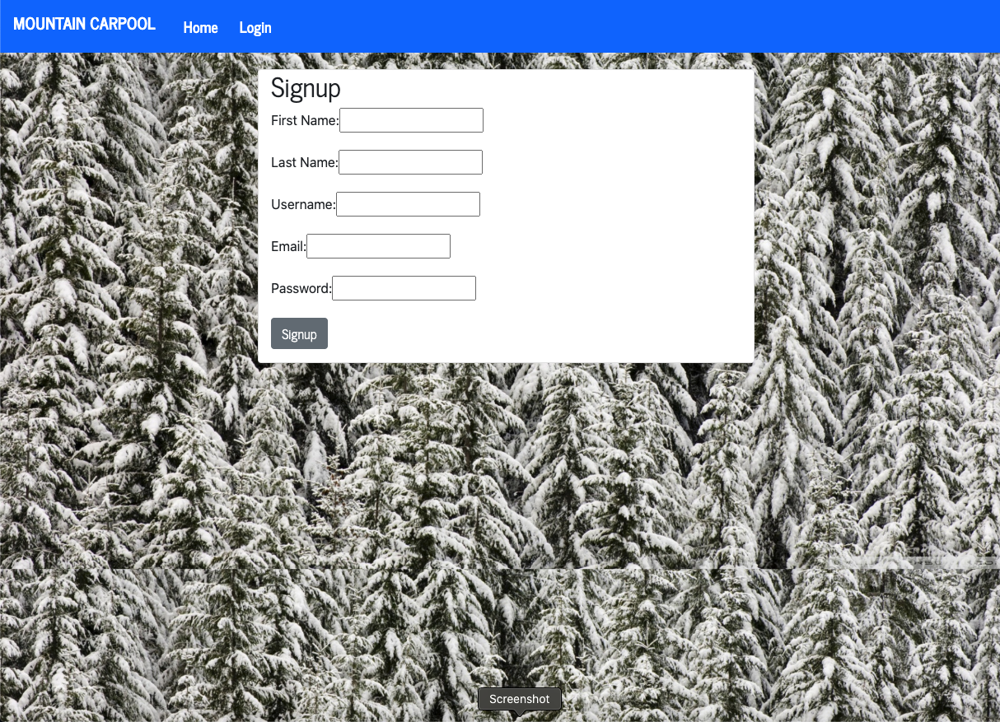
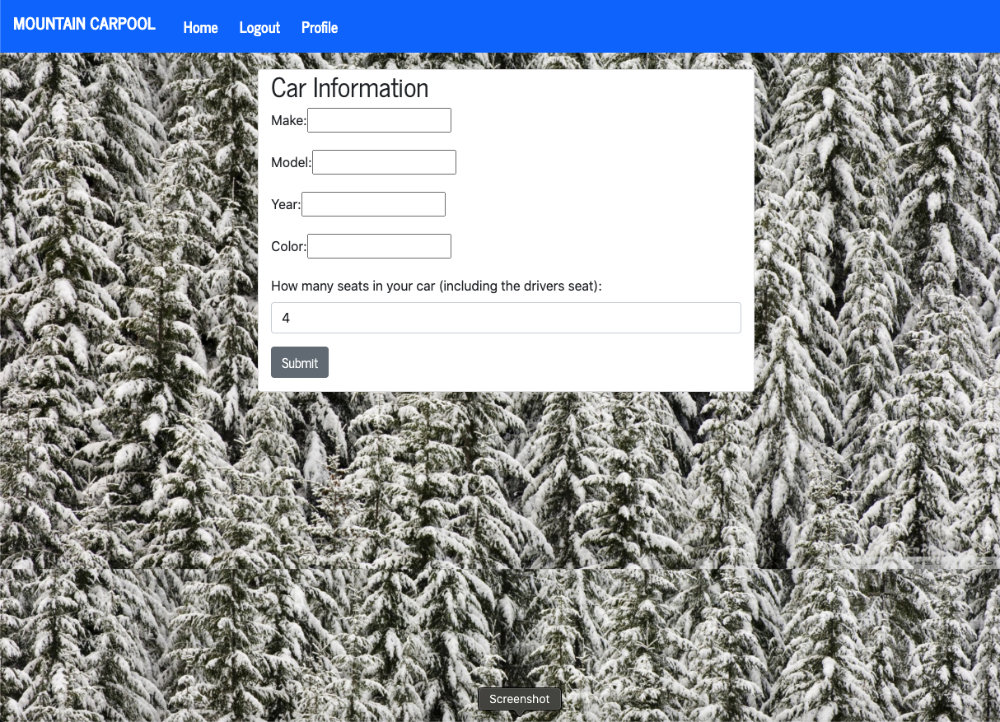
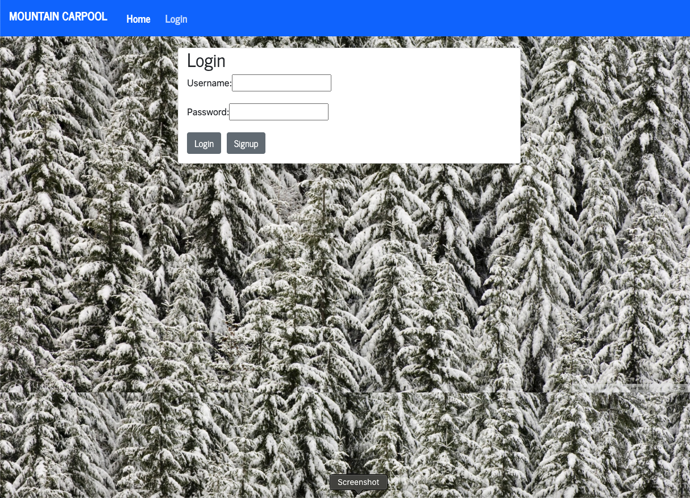
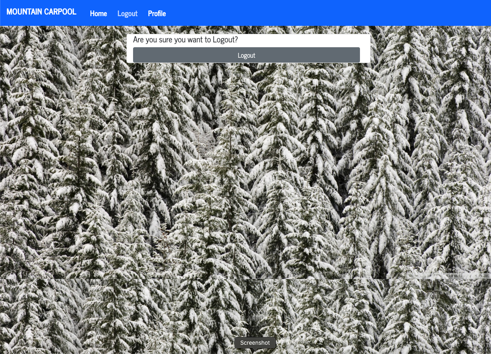
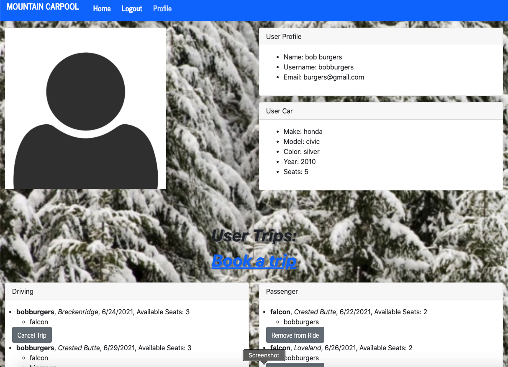
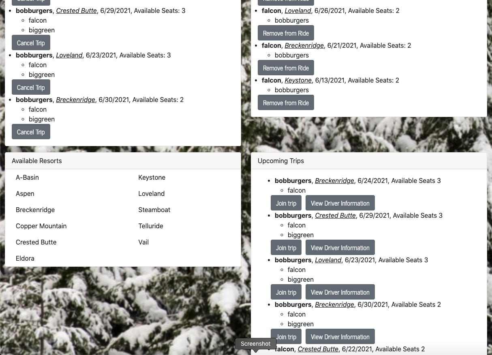
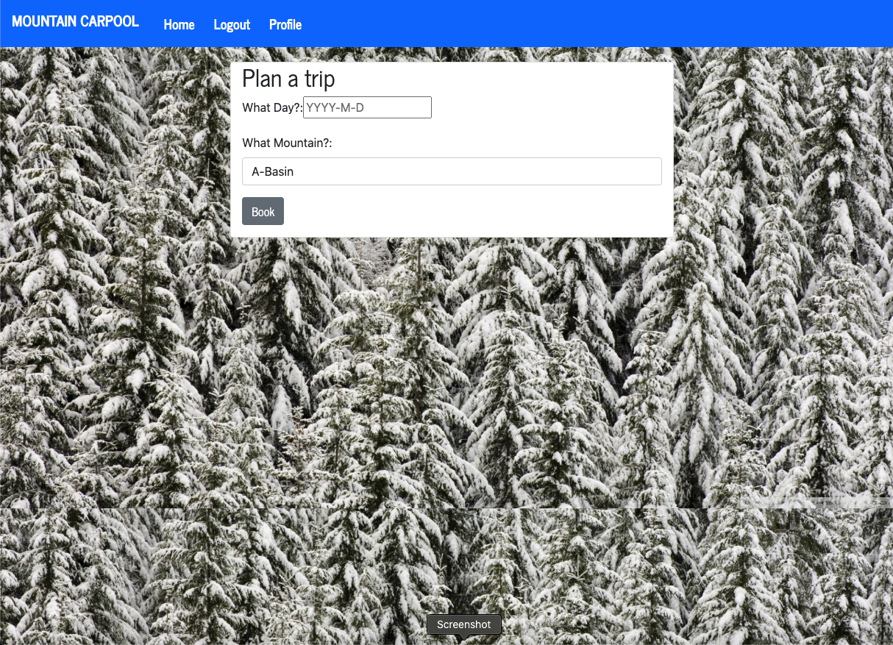

# Mountian-Planner
[](https://opensource.org/licenses/MIT)

## Description
Plan or join carpool rides to your favorite colorado resorts.


















[link](https://secure-fortress-31998.herokuapp.com/)

## Table of Contents
* [Installation](#installation)
* [Usage](#usage)
* [Contribute](#contribute)
* [Questions](#questions)
## Installion
For this project be sure to run the following command in your terminal to install the necessary dependencies.
```
npm i
```

## Usage
visit it at
## License
MIT## Contribute
email bfitzpatrick28@gmail.com

## Questions
If you have any questions at all please reach out to [fitzpatb](https://github.com/fitzpatb/Mountain-Planner) or email directly at bfitzpatrick28@gmail.com